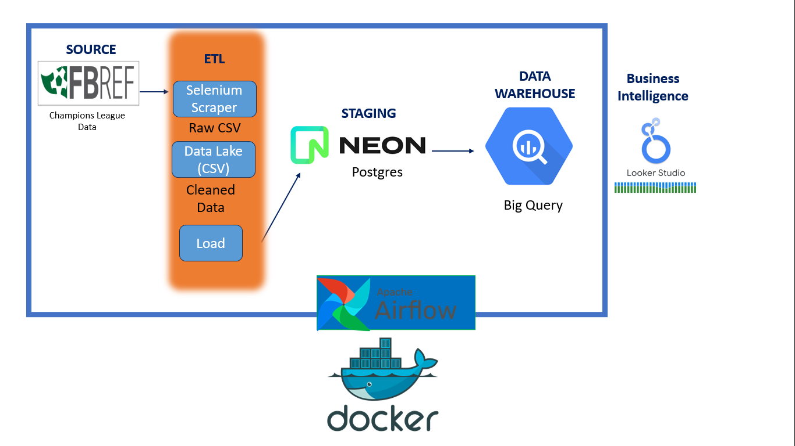
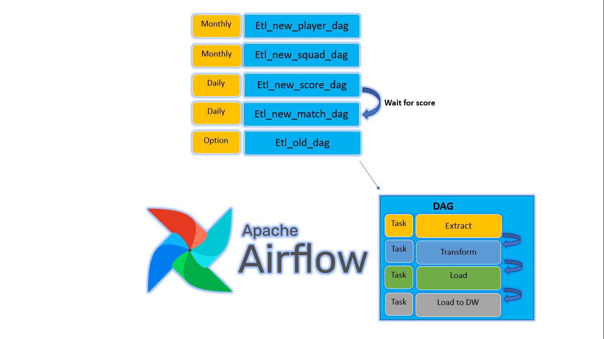
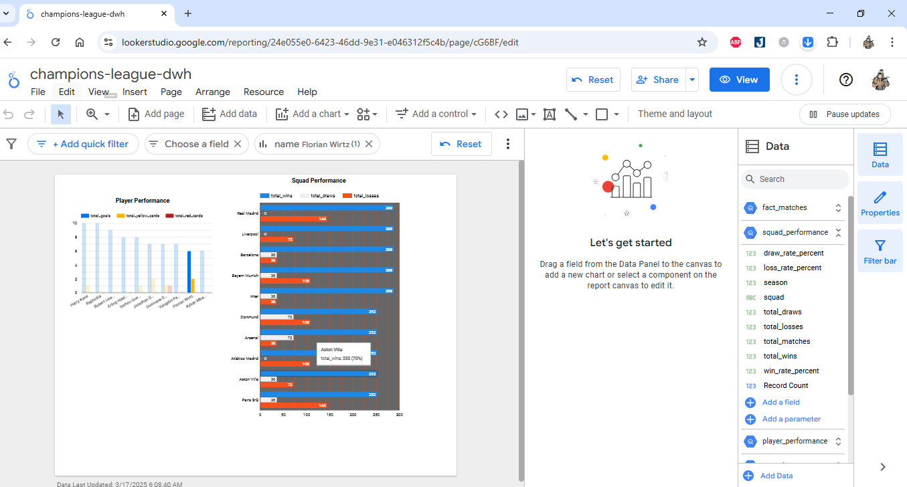
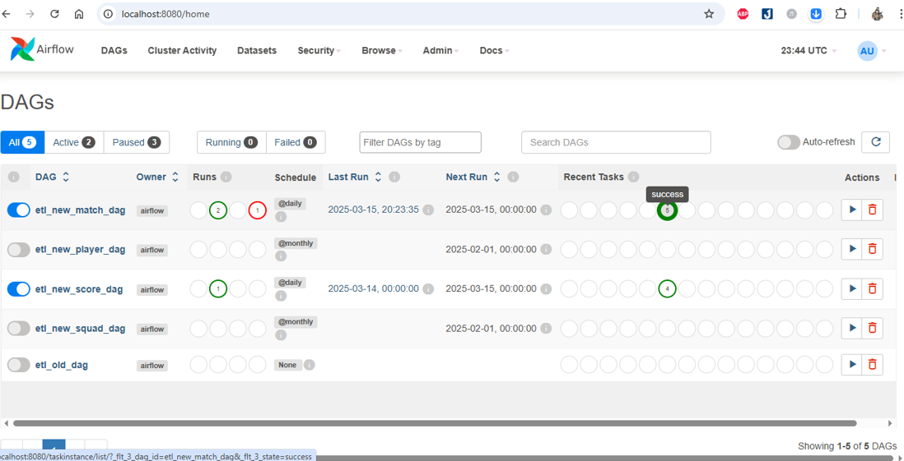

# Champions League Data Pipeline with Airflow & BigQuery
## Project Overview
This project automates the extraction, transformation, and loading (ETL) of football match data from FBref into Google BigQuery for analysis. The pipeline is orchestrated using Apache Airflow and runs inside Docker containers.
## Tech Stack
* Airflow: For workflow orchestration
* Google BigQuery: Data warehouse for storing and analyzing data
* PostgreSQL (NeonDB): Staging database before loading into BigQuery
* Selenium: Web scraping FBref for match data
* Docker: Containerized deployment
## Data Pipeline Architecture
1. Extract: Scrape match data from FBref using Selenium. Save as .CSV
2. Transform: Clean and structure the data. Save as .CSV
3. Load: Store in NeonDB (staging), then transfer to BigQuery.

4. Orchestrate: Use Airflow to schedule and monitor the pipeline.

5. Business intelligence: Use Looker Studioto connect with data warehouse big query

## Setup & Installation
### Prerequisites

- Docker & Docker Compose
- Google Cloud SDK (for BigQuery access)

### Steps to Run

1. Clone the repository:
   ```bash
   git clone <https://github.com/THANHTINHSHR/champions-league-dwh>
   ```
2. Download Docker images:
    ```bash
    # Pull postgres
    docker pull postgres:13
    # Pull apache/airflow
    docker pull apache/airflow:2.8.1
    # Build project image (etl-selenium)
    docker build -t etl-selenium -f Dockerfile.etl . 
    ```
3. Create user/password for airflow:
    ```bash
    docker-compose run airflow-webserver airflow users create `
    --username admin `
    --password admin `
    --firstname Admin `
    --lastname User `
    --role Admin `
    --email admin@example.com
    ```
3. Start the pipeline using Docker:
   ```bash
   docker-compose up -d
   ```
5. Access Airflow UI:
*  After 1-3 minute (for airflow run) :
   - Open browser and go to `http://localhost:8080`
   - Login with: `admin / admin`
6. Trigger the DAG to start the ETL process if you want!
    
7. View dashboard:
    [📊 View Dashboard]
https://lookerstudio.google.com/reporting/24e055e0-6423-46dd-9e31-e046312f5c4b
7. DAG Dependencies & Performance Notes:
    - Old data is set from season 2022. You can modify it in .env.
    - etl_old_dag may be resource-intensive.
    - etl_new_match_dag depends on etl_new_score_dag to run successfully.

# Contact
For any inquiries or collaboration, feel free to reach out:
Email: thanhtinh14.06.1998@gmail.com